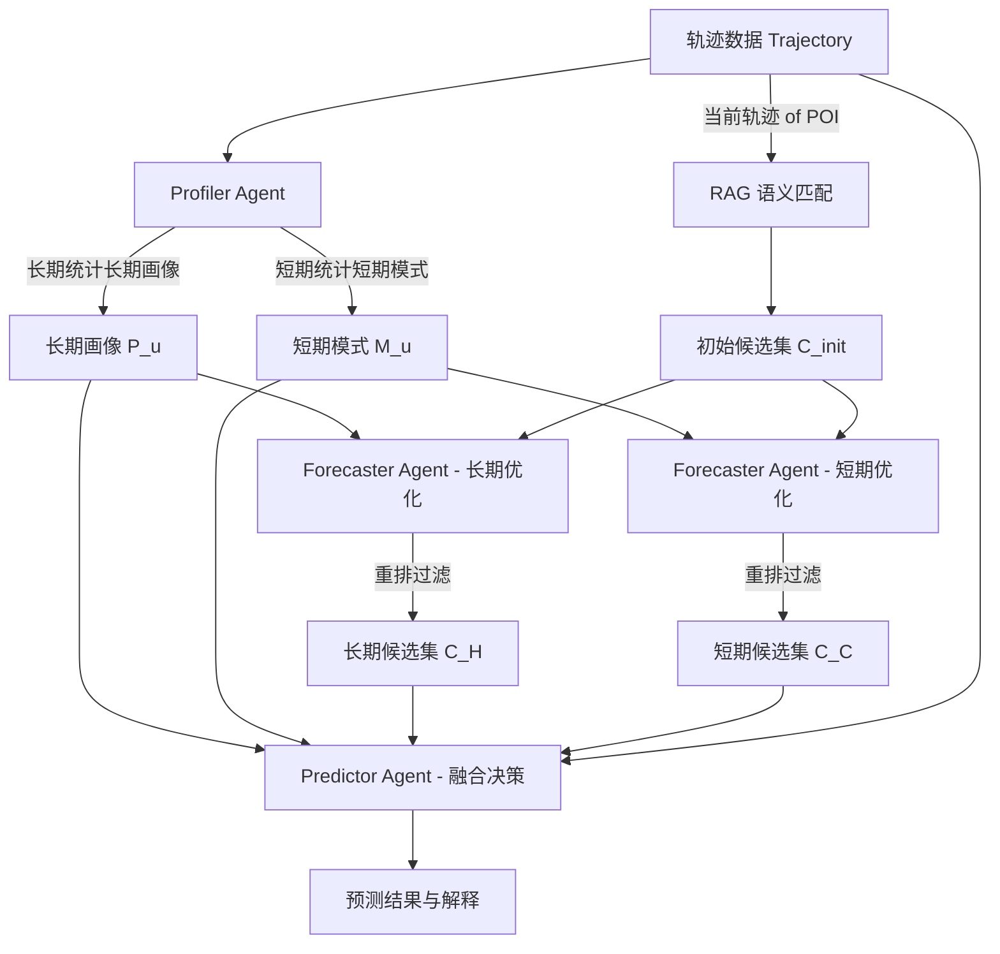

# CoMaPOI 论文精读与核心整理

本篇文档针对 **CoMaPOI: A Collaborative Multi-Agent Framework for Next POI Prediction Bridging the Gap Between Trajectory and Language** 进行了整理。
本整理采用 **“AI-EZ (易读易懂) 风格”**，对引言与相关工作进行极简提炼，对**数学定义、核心方法（公式推导与设计逻辑）以及实验数据（完整表格与消融分析）**进行详尽、无损的整理。

---

## 目录
1. [引言与相关工作 (极简整理)](#1-引言与相关工作-极简整理)
2. [问题定义与前置概念 (Preliminaries)](#2-问题定义与前置概念-preliminaries)
3. [方法设计 (Methodology) - 核心剖析](#3-方法设计-methodology---核心剖析)
4. [逆向推理微调 (RRF) - 如何训练 Agent](#4-逆向推理微调-rrf---如何训练-agent)
5. [候选空间缩减的理论证明 (Theoretical Analysis)](#5-候选空间缩减-theoretical-analysis)
6. [实验结果与分析 (Experiments)](#6-实验结果与分析-experiments)

---

## 1. 引言与相关工作 (极简整理)

### 核心背景
下一个 POI（Point of Interest，兴趣点）预测旨在根据用户的历史签到轨迹，预测其下一步最可能访问的地点。

### 传统方法的瓶颈
* **深度学习模型**（如 RNN、LSTM、Transformer、GNN）：虽然能捕获复杂的时空依赖，但**缺乏语义理解和可解释性**，在面对动态、复杂的语义需求时表现较差。
* **直接使用大语言模型（LLM）**：
  1. **无法直接理解时空数值**：LLM 擅长处理文本，但对坐标（经纬度）、连续时间和距离等数值极其不敏感。
  2. **候选空间过于庞大且无约束**：一个城市有成千上万个 POI，直接让 LLM 从中做多分类容易产生随机或无关的预测（幻觉）。

### 本文的核心思想 (CoMaPOI)
提出一个**多 Agent 协同框架 (CoMaPOI)**。将任务拆解为三个角色：
1. **Profiler Agent**：利用统计工具，将数值轨迹翻译成大模型能懂的“自然语言描述”。
2. **Forecaster Agent**：利用 RAG 相似度检索并结合用户画像，将 candidate 空间从几十万缩减到几十个高概率点。
3. **Predictor Agent**：整合上述信息，进行高精度预测并给出解释。
并引入了**逆向推理微调（Reverse Reasoning Fine-Tuning, RRF）**解决中间 Agent 缺乏标注数据的训练难题。

---

## 2. 问题定义与前置概念 (Preliminaries)

为了确保公式的严谨性，以下是论文中定义的数学符号：

* **用户与 POI 集合**：
  * 用户集：$\mathcal{U} = \{u_1, u_2, \dots, u_N\}$
  * POI 集合：$\mathcal{P} = \{p_1, p_2, \dots, p_M\}$
* **兴趣点 (POI) 定义**：
  每个 POI $p \in \mathcal{P}$ 可以用一个四元组表示：
  $$p = \langle l, \text{lat}, \text{lon}, c \rangle$$
  其中 $l$ 是 POI 的唯一 ID，$\text{lat}$ 和 $\text{lon}$ 分别是经纬度，$c$ 表示该 POI 的类别（如餐馆、公园）。
* **签到行为 (Check-In)**：
  定义为一个三元组：
  $$x = \langle u, p, t \rangle$$
  其中 $u \in \mathcal{U}$ 是用户，$p \in \mathcal{P}$ 是访问的 POI，$t \in \mathcal{T}$ 是时间戳。
* **历史轨迹 (Historical Trajectory)**：
  反映用户的长期兴趣偏好（排除最近的 $L$ 次签到）：
  $$\mathcal{T}^H_u = \{ \langle p_{u,1}, t_{u,1} \rangle, \dots, \langle p_{u, n_u - L - 1}, t_{u, n_u - L - 1} \rangle \}$$
* **当前轨迹 (Current Trajectory)**：
  反映用户的短期即时偏好（最近的 $L$ 次签到）：
  $$\mathcal{T}^C_u = \{ \langle p_{u, n_u - L}, t_{u, n_u - L} \rangle, \dots, \langle p_{u, n_u - 1}, t_{u, n_u - 1} \rangle \}$$
* **候选空间 (Candidate Space)**：
  候选集合 $C \subseteq \mathcal{P}$ 是预测下一步可能去向的子集。若不加约束，则 $C = \mathcal{P}$。
* **问题定义 (Problem Definition)**：
  已知用户的历史轨迹 $\mathcal{T}^H_u$（作为训练集）和当前轨迹 $\mathcal{T}^C_u$，预测用户下一步最可能访问的 POI $\hat{p}_{u, n_u}$：
  $$\hat{p}_{u, n_u} = f(\mathcal{T}^C_u)$$
  其中 $f(\cdot)$ 是预测函数（本文中由 LLM 实现）。

---

## 3. 方法设计 (Methodology) - 核心剖析

CoMaPOI 的核心是一个由三阶段 Agent 协同的推理流水线：

### 3.1 Profiler Agent: 轨迹数字化为文本
由于 LLM 对原始的 GPS 坐标和连续时间戳没有直观的物理空间概念，Profiler 充当“翻译官”，利用四个**统计分析工具（Toolbox）**把数据提取为自然语言可描述的特征：
$$\text{Tools} = \{\text{Tool}_{\text{freq}}, \text{Tool}_{\text{cat}}, \text{Tool}_{\text{time}}, \text{Tool}_{\text{loc}}\}$$
* $\text{Tool}_{\text{cat}}$ 统计签到类别分布（例如：“家：117次；写字楼：51次；健身房：25次”）。
* 其他工具统计访问频次、活跃时间段、核心活动半径等。

#### 长期画像生成 (Long-term Profile)
使用长期历史轨迹 $\mathcal{T}^H_u$ 的统计结果来构建用户画像 $P_u$（包含年龄、职业、社交偏好、生活方式等概括）：
$$\{X^{\text{freq}, H}_u, X^{\text{cat}, H}_u, X^{\text{time}, H}_u, X^{\text{loc}, H}_u \} = \text{Tools}(\mathcal{T}^H_u)$$
$$P_u \leftarrow \text{LLM}(\{ X^{\text{freq}, H}_u, X^{\text{cat}, H}_u, X^{\text{time}, H}_u, X^{\text{loc}, H}_u \}, \mathcal{T}^H_u)$$

#### 短期移动模式生成 (Short-term Mobility Pattern)
使用当前轨迹 $\mathcal{T}^C_u$ 的统计结果分析用户最近的出行模式 $M_u$（如当前高峰期、主要目的地、日常路线）：
$$M_u \leftarrow \text{LLM}(\{ X^{\text{freq}, C}_u, X^{\text{cat}, C}_u, X^{\text{time}, C}_u, X^{\text{loc}, C}_u \}, \mathcal{T}^C_u)$$

---

### 3.2 Forecaster Agent: 动态缩减候选空间
传统的检索方法会将全城成千上万个 POI 作为候选项。Forecaster 分为**初筛**和**精排优化**两步：

#### 步骤 1：基于 RAG 的向量检索（初筛）
1. 将每个 POI 转化为自然语言描述，如：`"POI [ID] is located at coordinates (lat, lon), category: [category]"`。
2. 使用 **BCE 嵌入模型**将描述转换为向量表示，构建向量库 $V = \{(p, \mathbf{e}_p) \mid p \in \mathcal{P}\}$。
3. 对用户当前轨迹 $\mathcal{T}^C_u$ 中的每一个已访 POI $p_{u, i}$ 计算其向量 $\mathbf{e}_{p_{u, i}}$。
4. 检索向量库中与之最相似 of $K_c$ 个 POI，计算公式为：
   $$C_{p_{u, i}} = \arg \max_{C \subseteq \mathcal{P}, |C| = K_c} \sum_{p \in C} \text{sim}(\mathbf{e}_{p_{u, i}}, \mathbf{e}_p)$$
   其中相似度由余弦相似度计算：$\text{sim}(\mathbf{e}_{p_{u, i}}, \mathbf{e}_p) = \frac{\mathbf{e}_{p_{u, i}} \cdot \mathbf{e}_p}{\|\mathbf{e}_{p_{u, i}}\| \|\mathbf{e}_p\|}$。
5. 将当前轨迹中所有已访点初筛出的 POI 集合取并集，得到初始候选集 $C^{\text{init}}_u$：
   $$C^{\text{init}}_u = \bigcup_{p_{u, i} \in \mathcal{T}^C_u} C_{p_{u, i}}$$
   *(通常 $C^{\text{init}}_u$ 大小约为 250 左右)*

#### 步骤 2：基于 LLM 的意图精排（精细化候选集）
为了从初始的大候选集中进一步提炼并减少噪声，Forecaster 结合 Profiler 产生的画像进行重排，生成两个更精准的候选子集（目标是把候选集大小从 250 降到 25 左右，同时保证高召回）：
* **长期偏好候选集** $C^H_u$：结合长期用户画像 $P_u$ 进行重排
  $$C^H_u \leftarrow \text{LLM}(P_u, C^{\text{init}}_u)$$
* **短期模式候选集** $C^C_u$：结合短期移动模式 $M_u$ 进行重排
  $$C^C_u \leftarrow \text{LLM}(M_u, C^{\text{init}}_u)$$

---

### 3.3 Predictor Agent: 综合决策预测
Predictor 综合以上所有生成的上下文信息进行最终预测。由于输入了高度精炼的候选集，模型出错的概率显著降低。
$$\hat{p}_{u, n_u} \leftarrow \text{LLM}(\{ P_u, M_u, C^H_u, C^C_u \}, \mathcal{T}^C_u)$$
Predictor 必须从联合候选集 $C^H_u \cup C^C_u$ 中做出最终选择（若有必要，也可选择该集合外的点），并输出推理依据。

---

## 4. 逆向推理微调 (RRF) - 如何训练 Agent

> [!IMPORTANT]
> **RRF 解决的痛点**：
> 在实际的数据集中，**只有最终的“下一个 POI 真实标签”**，而**没有** Profiler 应该生成的“标准用户画像描述”和 Forecaster 应该产生的“最优精炼候选集”。
> 如果直接微调，这些中间 Agent 无法获得高质量的监督信号。

### 逆向推理微调 (RRF) 流程

RRF 的核心思想是**“以终为始”**：

#### 1. 逆向标注 (Backward Reconstruction)
既然已知正确的下一步 POI 标签 $p_{u, n_u}$，我们就**反向**去寻找能够推导至该正确结果的“最佳画像”和“最佳候选集”。
* **反向推导最优画像与移动模式**：
  通过最大化对齐得分 $S$，反向推导最有利于预测出 $p_{u, n_u}$ 的画像 $P^+_u$ 和模式 $M^+_u$：
  $$(P^+_u, M^+_u) \leftarrow \arg \max_{P, M} S(P_u, C^H_u; p_{u, n_u})$$
* **反向推导最优候选集**：
  同样，确保正确的 POI $p_{u, n_u}$ 必须包含在最优候选集中，并最大化对齐得分：
  $$(C^{H,+}_u, C^{C,+}_u) \leftarrow \arg \max_{M, C} S(M_u, C^C_u; p_{u, n_u})$$

> [!TIP]
> **EZ 释义**：在训练前，先让大模型看着标准答案 $p_{u, n_u}$ 回答：“如果要预测对这个答案，你觉得这个用户的画像应该长什么样？最精炼的候选集应该包含哪些点？”。由此生成的最佳回答作为训练的 **Gold Standard (金标准) 标签**。

#### 2. 联合监督微调 (Joint SFT)
获得这些反向重构的高质量推理样本后，我们将 Profiler、Forecaster 和 Predictor 统一进行端到端的微调，最小化负对数似然：
$$(\hat{\theta}_p, \hat{\theta}_f, \hat{\theta}_r) = \arg \min_{\theta_p, \theta_f, \theta_r} \sum -\log P_\theta (p_{u, n_u} \mid X^+)$$
where $X^+$ 为反向生成的金标准样本集合 $(P^+_u, M^+_u, C^{H,+}_u, C^{C,+}_u)$，微调过程采用 LoRA 与 4-bit 量化加速（基于 TRL 框架）。

---

## 5. 候选空间缩减的理论证明 (Theoretical Analysis)

> [!NOTE]
> **理论要解决的问题**：
> 限制候选集确实能降低预测误差吗？还是只引入了更多噪音？作者在数学上证明了这一点。

假设所有 POI 的集合为 $\mathcal{P}$，大小为 $M$。真实的下一个 POI 标签为 $p^*$。

### 1. 全局搜索 (Global Search) 的误差
若模型不使用候选集，直接在全城搜索预测，其预测错误的概率为：
$$\text{Error}_{\text{global}} = 1 - P(p^* \mid \mathcal{T}^C_u)$$

### 2. 候选集预测 (Candidate-based) 的误差
设 Forecaster 筛选出的优化候选集为 $C \subseteq \mathcal{P}$，其中候选集大小远远小于城市 POI 总数 ($|C| \ll M$)。
若要预测错误，会有两种可能的情况：
* **情况一**：正确答案 $p^*$ **在**候选集 $C$ 中，但模型依然预测错了。
* **情况二**：正确答案 $p^*$ **不在**候选集 $C$ 中，模型肯定预测错。

由此，候选预测误差公式表示为：
$$\text{Error}_{\text{with candidate}} = P(p^* \in C) \left[ 1 - P(p^* \mid \mathcal{T}^C_u, p^* \in C) \right] + \left[ 1 - P(p^* \in C) \right] \left[ 1 - P(p^* \mid \mathcal{T}^C_u, p^* \notin C) \right]$$

### 3. 候选集预测优于全局搜索的必要条件
要使 $\text{Error}_{\text{with candidate}} < \text{Error}_{\text{global}}$ 成立，带入定义化简并移项：
$$P(p^* \in C) P(p^* \mid \mathcal{T}^C_u, p^* \in C) + [1 - P(p^* \in C)] P(p^* \mid \mathcal{T}^C_u, p^* \notin C) > P(p^* \mid \mathcal{T}^C_u)$$
最终隔离出**候选集的召回率下界**：
$$P(p^* \in C) > \frac{P(p^* \mid \mathcal{T}^C_u) - P(p^* \mid \mathcal{T}^C_u, p^* \notin C)}{P(p^* \mid \mathcal{T}^C_u, p^* \in C) - P(p^* \mid \mathcal{T}^C_u, p^* \notin C)}$$

> [!TIP]
> **EZ 释义**：这表明，只要我们的 Forecaster 筛选候选集时，**候选集的命中率（Hit Rate）** $P(p^* \in C)$ 高于右边这个数学下界（Lower Bound），模型在候选集里做选择就必然优于直接全局搜索。
> 本文的实验数据（见下表3）严格证明了 CoMaPOI 优化的候选集命中率远远超过了该理论下界，证明了该方法的数学合理性。

---

## 6. 实验结果与分析 (Experiments)

### 6.1 实验设置
* **数据集**：
  * **NYC**：纽约市，988 用户，5086 个 POI，99,964 次签到。
  * **TKY**：东京市，2206 用户，7849 个 POI，325,313 次签到。
  * **CA**：加利福尼亚/内华达，1818 用户，13564 个 POI，174,791 次签到。
* **测试方式**：取每个用户最后 30 次签到作为测试集（当前轨迹），其余作为训练集（历史轨迹）。
* **基础大模型**：Llama-3.1-8B (默认)，对比评估了 Mistral-7B 和 Qwen2.5-7B，以及端侧小模型 Llama-3.2-3B 和 Qwen2.5-0.5B。

---

### 6.2 主实验结果对比 (Table 1)
以下是 CoMaPOI 与 11 种 SOTA 基线模型在三个数据集上的对比（**所有数据无删减整理**）：

| 类别 / 模型 | NYC HR@5 | NYC HR@10 | NYC NDCG@5 | NYC NDCG@10 | NYC MRR | TKY HR@5 | TKY HR@10 | TKY NDCG@5 | TKY NDCG@10 | TKY MRR | CA HR@5 | CA HR@10 | CA NDCG@5 | CA NDCG@10 | CA MRR |
| :--- | :---: | :---: | :---: | :---: | :---: | :---: | :---: | :---: | :---: | :---: | :---: | :---: | :---: | :---: | :---: |
| **传统序列模型** | | | | | | | | | | | | | | | |
| SASRec | 40.38 | 48.28 | 28.98 | 31.26 | 27.01 | 34.72 | 43.25 | 25.48 | 28.37 | 24.70 | 21.34 | 26.40 | 16.04 | 17.68 | 15.94 |
| BERT4Rec | 39.60 | 46.70 | 29.03 | 30.94 | 27.11 | 36.17 | 43.47 | 26.70 | 29.08 | 25.39 | 23.22 | 28.22 | 17.26 | 18.66 | 16.61 |
| DuoRec | 34.72 | 40.69 | 24.54 | 26.34 | 22.76 | 24.66 | 31.19 | 18.77 | 20.89 | 18.67 | 19.47 | 24.04 | 14.47 | 15.85 | 14.31 |
| TiCoSeRec | 40.69 | 48.08 | 29.65 | 32.04 | 27.54 | 29.33 | 37.04 | 21.83 | 24.21 | 21.51 | 22.66 | 28.11 | 16.99 | 18.48 | 16.75 |
| **图/对比学习** | | | | | | | | | | | | | | | |
| CrossDR | 40.80 | 47.20 | 30.67 | 32.59 | 28.66 | 32.51 | 40.57 | 23.58 | 26.19 | 22.65 | 22.11 | 28.61 | 16.11 | 18.18 | 15.79 |
| MAERec | 37.65 | 44.53 | 27.72 | 29.85 | 26.10 | 32.73 | 40.66 | 23.93 | 26.14 | 23.05 | 24.37 | 29.37 | 17.76 | 19.48 | 17.09 |
| GETNext | 43.60 | 51.30 | 32.56 | 35.13 | 30.97 | 41.11 | 48.50 | 30.75 | 33.21 | 29.21 | 24.26 | 29.32 | 17.83 | 19.48 | 17.16 |
| **生成/扩散模型** | | | | | | | | | | | | | | | |
| POIGDE | 34.11 | 38.36 | 26.64 | 27.97 | 25.40 | 28.20 | 31.82 | 22.46 | 23.57 | 21.80 | 22.61 | 26.73 | 18.24 | 19.49 | 17.89 |
| MTNet | 47.57 | 53.24 | 35.85 | 37.69 | 33.40 | 44.15 | 51.22 | 32.99 | 35.37 | 31.18 | 30.25 | 36.08 | 22.39 | 24.27 | 21.35 |
| DiffuRec | 37.25 | 40.79 | 29.16 | 30.23 | 27.74 | 34.50 | 39.89 | 26.89 | 28.70 | 25.94 | 21.67 | 24.15 | 17.35 | 18.06 | 16.60 |
| **大模型（LLM）** | | | | | | | | | | | | | | | |
| LLM4POI | 44.64 | 46.66 | 37.49 | 38.16 | 35.90 | 34.90 | 39.48 | 27.23 | 28.22 | 29.72 | 23.65 | 25.91 | 19.01 | 19.39 | 20.13 |
| **我们的方法** | | | | | | | | | | | | | | | |
| **CoMaPOI (ours)** | **51.62** | **59.01** | **40.42** | **42.82** | **37.67** | **45.83** | **54.26** | **34.48** | **37.20** | **31.82** | **33.00** | **39.16** | **24.96** | **26.96** | **23.10** |
| *提升幅度* | *+8.51%* | *+10.84%* | *+7.82%* | *+12.21%* | *+4.93%* | *+3.81%* | *+5.94%* | *+4.52%* | *+5.17%* | *+2.05%* | *+9.09%* | *+8.54%* | *+11.48%* | *+11.08%* | *+8.20%* |

#### 结果分析
* **全面领先**：CoMaPOI 在三个公开数据集上以绝对优势战胜了所有传统模型以及此前的 LLM 基线模型（平均提升 5%~10%）。
* **克服空间广度瓶颈**：在 CA（加州）数据集中（包含最多的 13,564 个 POI 节点，地理跨度最大），传统模型极易失效，而 CoMaPOI 利用 Forecaster 大幅限制了候选范围，使其在 CA 上的 NDCG@10 相比 MTNet 提升了 **11.08%**。

---

### 6.3 消融实验 (Table 2)
为了验证协同框架中每个组件的作用，作者进行了消融分析：

* `w/o Profiler`：去掉 Profiler，LLM 无法接收自然语言描述的用户画像，只能看原始轨迹数值。
* `w/o Forecaster`：去掉精排缩减，直接把 RAG 初筛出的所有 POI 候选提供给 Predictor。
* `w/o RRF`：微调阶段不进行逆向推理样本生成，仅用常规的标签微调。
* `w/o Refine`：不区分长期/短期候选集重排，直接从初始 RAG 候选集中随机取子集。
* `only Single Agent`：仅使用一个 Agent 同时处理画像、精排和预测。
* `only SFT`：最基础的单阶段监督微调。

| 消融配置 (Setting) | NYC HR@10 / NDCG@10 | TKY HR@10 / NDCG@10 | CA HR@10 / NDCG@10 |
| :--- | :---: | :---: | :---: |
| **CoMaPOI (完整模型)** | **59.01 / 42.82** | **54.26 / 37.20** | **39.16 / 26.96** |
| w/o Profiler | 58.60 / 40.59 | 52.40 / 34.93 | 32.01 / 22.31 |
| w/o Forecaster | 56.48 / 39.61 | 49.86 / 34.86 | 35.64 / 23.61 |
| w/o RRF | 54.35 / 38.40 | 46.51 / 31.83 | 32.84 / 22.86 |
| w/o Refine | 57.79 / 40.63 | 51.86 / 35.11 | 37.46 / 26.09 |
| only Single Agent | 56.91 / 40.52 | 51.72 / 35.61 | 37.27 / 25.48 |
| only SFT | 47.77 / 35.32 | 41.75 / 30.39 | 29.10 / 22.38 |

#### 消融结论
1. **RRF 逆向微调至关重要**：缺少 RRF 的表现会剧烈下降（如在 TKY 上 NDCG@10 从 37.20 掉至 31.83）。这证明了大模型需要先“倒果为因”训练出最佳画像和精简候选的模式，在推理时才有更好的表现。
2. **多 Agent 协同的优越性**：`only Single Agent`（让单模型同时负责所有推理）的表现明显弱于多 Agent 分工模式，说明解耦复杂任务有利于降低 LLM 的上下文认知负荷。

---

### 6.4 候选集合验证与不等式下界校验 (Table 3)
此项实验不仅验证了**候选集在各阶段的命中率（Hit Rate）**，还严格代入了我们在第 5 节中推导出的**理论召回率下界不等式 (17)**。

* **命中率（Hit Rate）定义**：正确 POI $p^*$ 是否存在于当前生成的候选集中。

| 指标 / 阶段 | NYC (%) | TKY (%) | CA (%) |
| :--- | :---: | :---: | :---: |
| **候选集各阶段命中率** | | | |
| 1. 向量数据库初始初筛命中率 (RAG) | 43.52 | 37.81 | 18.43 |
| 2. 基于长期画像重排的候选集命中率 | 61.13 | 42.43 | 43.95 |
| 3. 基于短期移动模式重排的候选集命中率 | 63.66 | 42.11 | 42.30 |
| **4. 双通道融合候选集命中率 $P(p^* \in C)$** | **67.51** | **62.15** | **50.17** |
| **预测统计概率** | | | |
| 5. 全局搜索预测成功率 $P(p^* \mid \mathcal{T}^C_u)$ | 36.03 | 31.87 | 22.00 |
| 6. 候选集内预测成功率 $P(p^* \mid \mathcal{T}^C_u, p^* \in C)$ | 88.16 | 79.21 | 77.96 |
| 7. 候选集外预测成功率 $P(p^* \mid \mathcal{T}^C_u, p^* \notin C)$ | 0.31 | 13.17 | 0.33 |
| **理论不等式校验 (等式 17)** | | | |
| **计算出的下界** | **45.27** | **28.31** | **28.02** |
| **验证结果 (命中率 > 理论下界)** | **67.51 > 45.27 (满足)** | **62.15 > 28.31 (满足)** | **50.17 > 28.02 (满足)** |

#### 关键观察
* **命中率飞跃**：单纯的 RAG 检索在地理跨度极大的 CA 数据集上命中率仅有 **18.43%**，但是经过 Forecaster Agent（画像+模式）优化过滤后，融合候选集的命中率达到了 **50.17%**。
* **不等式恒成立**：三个数据集上的融合候选集实际命中率均显着高于计算出的理论下界。这解释了为什么候选空间缩减后的 CoMaPOI 性能可以稳定战胜没有加候选集约束的全局搜索。

---

### 6.5 候选集大小 $K$ 对性能的影响

通过实验调整 Forecaster 生成的候选列表长度 $K$（从 0 到 100），发现：
* 随着 $K$ 的增加（由 0 增加至 25），性能（NDCG@10）呈持续上升趋势，这表明更大的候选集包含正确答案的机会更高。
* 当 $K > 25$ 时，性能**趋于平缓甚至开始微弱下降**。
* **原因**：过大的候选列表会重新为 Predictor 引入大量不相关的噪声地点，从而混淆大模型的判断力。因此，**$K = 25$ 是最佳的平衡点**。
